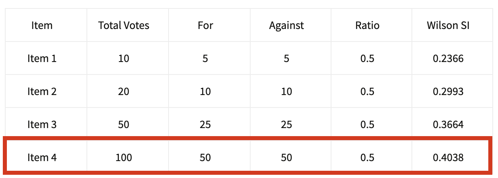
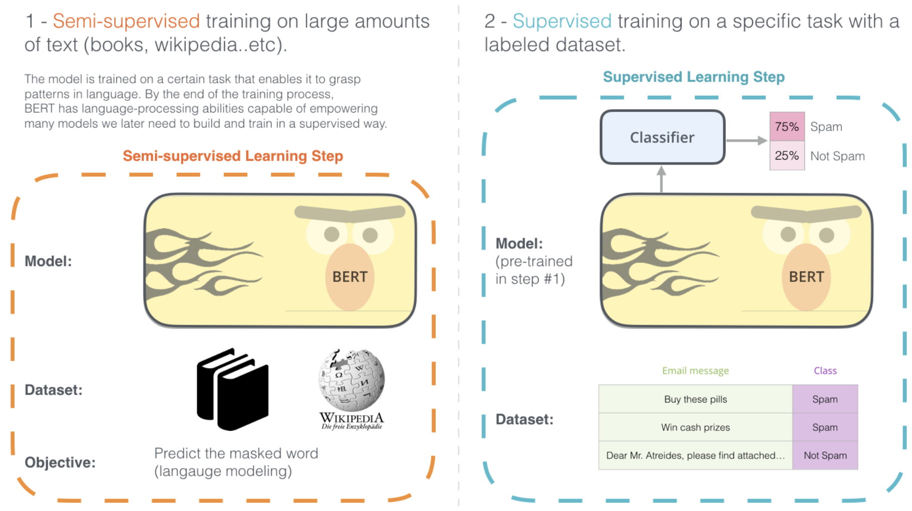
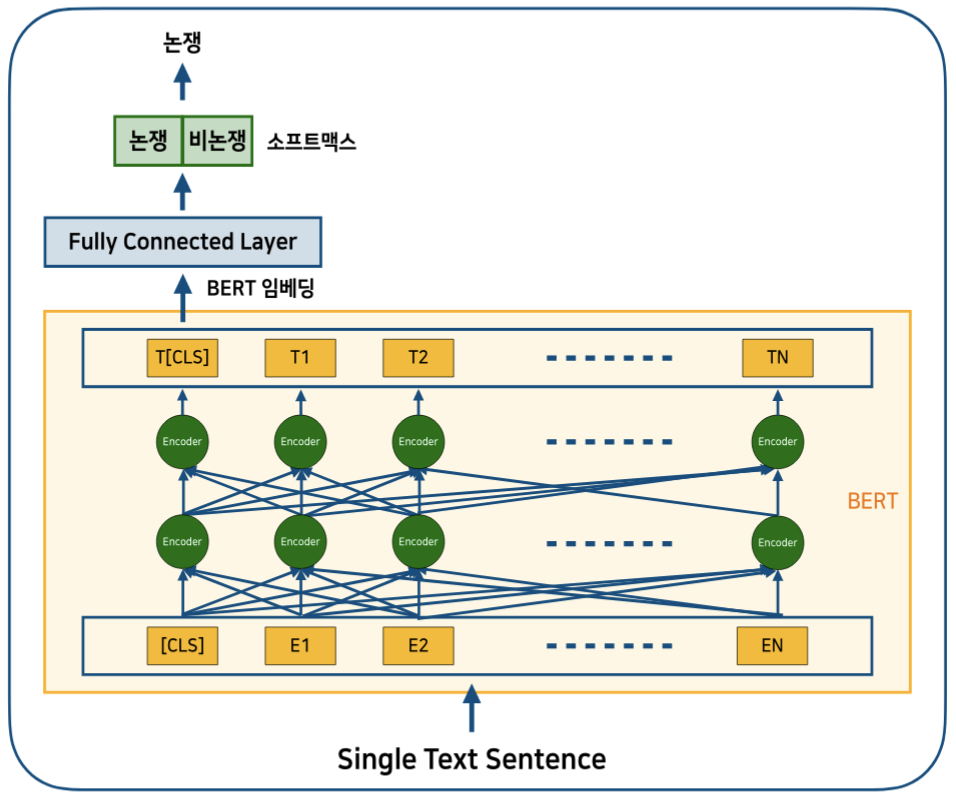

## KcBERT를 활용한 Transfer Learning 학습 일지

이번 석사 졸업 논문에 댓글을 논쟁적인 측면에서 분석하는 모델을 싣고자 했는데, 태스크가 새로운 것이다 보니 충분한 양의 데이터를 확보하기도 힘들었고, 기존 모델로는 괜찮은 성능이 나오지 않았다. 😭 이것저것 방법을 찾아보던 중 한국어 댓글 데이터로 학습된 BERT 모델이 최근에 공개된 것을 확인하여 연구 마무리에 활용하였다. 

### 문제 정의: 논쟁 댓글
이 연구에서 **댓글의 논쟁성**이란, 댓글에 대한 공감과 비공감 수치가 유사하게 나타나는 댓글을 논쟁 가능성이 높은 `논쟁 댓글`, 반대로 공감과 비공감 수치가 극적으로 차이가 보이는 댓글을 `비논쟁 댓글`이라 정의내렸다. 다시 말해 논쟁 댓글이란, 공감률( 공감 / (공감+비공감) )이 0.5에 근사하는 댓글. 많은 연구에서 댓글의 논쟁성을 다양하게 정의하고 있으며, 여기서는 댓글의 수치적 특성에서 드러나는 논쟁 정도에 주목하였다.

그러나 단순히 공감률만을 고려할 경우, 이용자의 반응이 충분하게 대립 되지 않음에도 논쟁 댓글로 탐지될 가능성이 존재한다. 예를 들면 댓글 A의 공감이 5, 비공감이 5 일 경우 논쟁의 정도가 약함에도 불구하고 공감률이 0.5 이기에, 공감이 50 비공감이 50으로 비교적 논쟁의 정도가 높은 댓글 B와 동일하게 분류될 수 있다. 이는 좋아요와 싫어요 수치로 순위를 매기는 다양한 웹사이트에서도 빈번하게 야기되는 문제이다. 

⮕ 잘못된 예시. 좋아요 1개 만으로 100% 공감이라 간주되어 상위 순위에 등재되어 있다. (from [how-not-to-sort-by-average-rating](https://www.evanmiller.org/how-not-to-sort-by-average-rating.html))

이에 보다 객관적인 공감률 지수를 산출하기 위해 전체 공감과 비공감의 개수를 함께 고려하는 이항 분포의 신뢰구간 추정 방식을 사용하였으며, 그 중에서도 극단치에 민감하지 않아 Reddit, Yelp 등의 플랫폼에서 사용되고 있는 윌슨의 방식을 선정하였다.  

이 연구에서는 표의 결과를 바탕으로 다음과 같이 논쟁/비논쟁 댓글을 저

- 윌슨 신뢰구간 하한 기준 0.4 에서 0.6
- 윌슨 신뢰구간 하한 기준 0.1 이하와 0.9 이상
윌슨 신뢰구간 하한 기준 0.4 에서 0.6 사이)과 비논쟁 댓글(윌슨 신뢰구간 하한 기준 0.1 이하와 0.9 이상)을 각각 정의하였다.

### 정의
이전에 내가 처한 상황처럼, 태스크가 새로워서 충분한 양의 데이터가 없고, 그만큼의 데이터를 학습할 리소스도 부족하고, 데드라인도 얼마 남지 않았을 때(..!) 사용할 수 있는 방법이 바로 `전이 학습` , `Transfer Learning`이다.  

이처럼 전이 학습은 딥러닝 분야에서는 굉장히 적다고 여겨지는 데이터 개수만으로도(태스크에 따라 다르지만, 1000개도 가능하다) 특정한 태스크를 수행할 수 있게 한다. 이는 과거 딥러닝 모델이 많은 라벨링 된 데이터를 필요로 하고 방대한 리소스를 잡아먹는 와중에 혁신적으로 등장한 개념이다. [앤드류 응 선생님](https://www.youtube.com/watch?v=wjqaz6m42wU&feature=youtu.be)이 2016년 NIPS 발표에서 Transfer Learning 개념을 소개한 것이 가장 유명하다.

더 기술적으로 설명하자면 전이 학습이란, 사전 학습된 모델의 가중치로 초기화된 모델을 나만의 태스크(downstream task)로 추가 학습시키는 것을 말한다. 이러한 추가 학습 과정을 통해 모델의 파라미터들은 나만의 다운스트림 태스크를 수행하기에 적절하게 튜닝된다. 결과적으로 학습이 완료된 모델을 통해 나의 태스크에 높은 성능을 얻을 수 있다. 이러한 다운스트림 태스크의 예로는 긍정 부정의 감정 분류, 악성 댓글 분류, 개체명 인식 등이 있다. 

> 다운스트림 태스크란, 사전 훈련된 모델이나 컴포넌트를 활용하는 지도 학습 태스크들을 부르는 명칭이다. 주로 NLP 분야에서 쓰이는 용어임 (출처 : [The Illustrated BERT, ELMo, and co. (How NLP Cracked Transfer Learning) – Jay Alammar – Visualizing machine learning one concept at a time.](http://jalammar.github.io/illustrated-bert/))

1) 사전 학습 단계 (BERT 모델 학습 단계 2) 사전 학습 모델을 통한 파인 튜닝 단계

### BERT
이때 대부분의 자연어 처리 과제에서는 사전 학습 모델로, 마스크 언어 모델(Masked Langauge Model, MLM)과 다음 문장 예측(Next Sentence Prediction, NSP)을 서브 태스크로 학습한 `BERT`를 사용하고 있다. 더 풀어서 말하자면, BERT 모델은 단어 중 일부를 마스크 토큰으로 랜덤으로 변화시킨 뒤에 해당 마스크 토큰을 예측하는 MLM 태스크와 두 문장을 이어 붙여 이것이 원래 말뭉치에서 이어져 있던 문장인지 맞추는 NSP 태스크를 수행하는데, 이 두 가지 서브 태스크만으로 BERT 모델은 여러 태스크에 대해서 파인 튜닝할 때 효과적으로 작용하게 된다. 

처음에는 컴퓨터 비전 쪽 전이 학습과 개념이 충돌해서 굉장히 헷갈렸는데, 컴퓨터 비전의 전이 학습은 라벨링 된 데이터(`source data`)와 태스크(`source task`), 그리고 현재 새롭게 적용하고자 하는 새로운 데이터셋(`target data`)고ㅘ 태스크(`target task`) 4가지를 동시에 고려해야 하기 때문에  완전히 다른 성격의 데이터이거나 태스크일 경우 학습 전략이 다르다. 한편, BERT의 경우 특정한 target task가 없기 때문에 source data만 고려하면 된다. 나의 경우에도 한국어 댓글 데이터로 학습된 BERT 모델에 논쟁과 비논쟁의 이진 분류 태스크를 추가하여 간단히 학습을 마무리  하였다.

이처럼 BERT는 파인 튜닝에 효과적으로 개발된 모델이라, 다른 도메인에서도 사전 학습된 BERT 모델을 파인 튜닝하고 사용하고 있다. 예를 들어 금융 분야의 [FinBERT](https://arxiv.org/abs/1908.10063), 과학 분야의 [SciBERT](https://arxiv.org/abs/1903.10676), 특허 분야의 [PatentBERT](https://arxiv.org/abs/1906.02124) 등등.. 모든 분야 다 나올 기세로 나오고 있다.

### 실험
실험에 사용된 데이터는 35,466개의 논쟁 댓글 분류 과제이며, 앞서 언급했던 이준범 님의 한국어 댓글 기반의 KcBERT(Korean Comments BERT)를 사용하였다.  KcBERT는 네이버 뉴스 플랫폼으로부터 2019년 1월 1일부터 2020년 6월 동안 수집된 약 1억 1천만 개 이상의 문장 데이터로 학습된 한국어 댓글 특화 모델이다.  버트 파인 튜닝 모델로는 버트 베이스 모델 기반으로 학습된 KcBERT-base 모델과 버트 라지 모델 기반으로 학습된 KcBERT-large 모델을 개발하였다. 그리고 그리고 일반적으로 자주 사용되는 김윤 교수님의 [Text-CNN](https://arxiv.org/abs/1408.5882) 총 세 가지 모델을 개발하여 성능을 비교하였다. Text-CNN 모델 또한 사전 학습된 단어 임베딩 워드투벡 모델 기반이다. 이 부분은 여기 담기엔 너무 길어질 듯하여 생략한다. 

버트 파인 튜닝의 과정은 다음과 같다. 먼저 사전 훈련된 BERT 모델에 문장을 제공하고, BERT를 통해 문장 임베딩 벡터 값을 추출한다. 추출된 벡터 값을 완전 연결 계층과 소프트맥스 함수에 적용해 논쟁과 비논쟁 댓글의 확률 벡터를 반환한다. 정말 이게 전부다! 🤨 더 심도 있는 튜닝이 가능하겠지만, 본인은 아직 새내기 단계라서 이 정도 간단한 튜닝만 진행하였다.

> 출처: 이기창님 저서 한국어 임베딩을 참고하여 그렸습니다

결과는 위와 같다. 사실 이진 분류를 고려한다면 좋은 결과는 아니지만, BERT 파인 튜닝 모델을 사용했을 때가 논쟁과 비논쟁을 골고루 예측하는 좋은 성과를 보여줬다.

---
[한국어 댓글 모델](https://github.com/Beomi/KcBERT) 공개해주신 이준범 님께 감사를 표합니다 :)

내용 피드백에 도움 주신 원익 님께도 감사드립니다.

## Reference
- http://wordpress.mrreid.org/2014/05/20/ranking-ratings/
- https://www.evanmiller.org/how-not-to-sort-by-average-rating.html

### 개념 참고
[Transfer learning & fine-tuning](https://keras.io/guides/transfer_learning/)
[Transfer Learning - ratsgo's NLPBOOK](https://ratsgo.github.io/nlpbook/docs/introduction/transfer/)
[The Illustrated BERT, ELMo, and co. (How NLP Cracked Transfer Learning) – Jay Alammar – Visualizing machine learning one concept at a time.](http://jalammar.github.io/illustrated-bert/)
[A Comprehensive Hands-on Guide to Transfer Learning with Real-World Applications in Deep Learning](https://towardsdatascience.com/a-comprehensive-hands-on-guide-to-transfer-learning-with-real-world-applications-in-deep-learning-212bf3b2f27a)
[BERT: Pre-training of Deep Bidirectional Transformers for Language Understanding](https://arxiv.org/abs/1810.04805)
[BERT 논문정리 · MinhoPark](https://mino-park7.github.io/nlp/2018/12/12/bert-%EB%85%BC%EB%AC%B8%EC%A0%95%EB%A6%AC/?fbclid=IwAR3S-8iLWEVG6FGUVxoYdwQyA-zG0GpOUzVEsFBd0ARFg4eFXqCyGLznu7w)

### 실습 참고
[publicservant_AI/03_케라스로_버트_빠르게_돌려보기_With_네이버_영화_감성분석_TUTORIAL.ipynb at master · kimwoonggon/publicservant_AI · GitHub](https://github.com/kimwoonggon/publicservant_AI/blob/master/03_%EC%BC%80%EB%9D%BC%EC%8A%A4%EB%A1%9C_%EB%B2%84%ED%8A%B8_%EB%B9%A0%EB%A5%B4%EA%B2%8C_%EB%8F%8C%EB%A0%A4%EB%B3%B4%EA%B8%B0_With_%EB%84%A4%EC%9D%B4%EB%B2%84_%EC%98%81%ED%99%94_%EA%B0%90%EC%84%B1%EB%B6%84%EC%84%9D_TUTORIAL.ipynb)
[Transfer Learning in Natural Language Processing - NAACL-HLT 2019](https://docs.google.com/presentation/d/1fIhGikFPnb7G5kr58OvYC3GN4io7MznnM0aAgadvJfc/edit#slide=id.g56add7608c_0_6)

<!--stackedit_data:
eyJoaXN0b3J5IjpbLTE5ODgyMjU3MSwxMTM0ODAxOTc5XX0=
-->