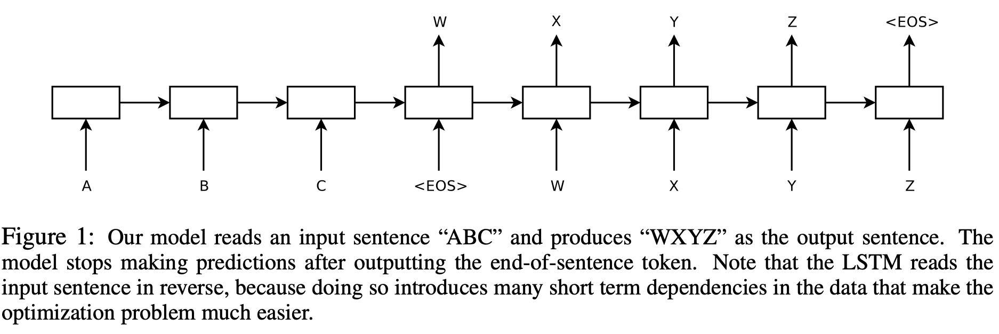
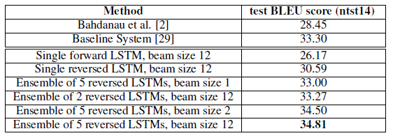

## Sequence to Sequence Learning with Neural Networks (2014) 논문 리뷰

#### Summary
기존의 Deep Neural Networks (DNN)은 고정 길이의 벡터 차원에만 적용 가능하기에, 일반적으로 길이가 다른 sequence에 적용시키기에 적절하지 않다. 텍스트를 예로 든다면 input으로 들어오는 텍스트의 길이는 서로 다르므로. 이 논문은 end-to-end 방법을 사용해서 sequence 학습을 가능하게 하는 다층의 Long Short-Term Memory (LSTM) 아키텍처를 제안한다. LSTM을 통해 input sequence를 고정 차원의 벡터로 표현시키고, 다른 LSTM을 통해 해당 벡터로부터 target sequence를 decoding 한다.

---

### Model

#### 기존 연구들의 문제점과 해결
* **Problem 1. input과 output의 길이가 다를 경우**
	* SOLVE ⮕ 하나의 RNN을 사용하여 input sequence를 고정 길이의 벡터로 변환시키고 다른 RNN을 사용해서 벡터를 target sequence로 변환
* **Problem 2. long term dependencies**
	* SOLVE ⮕ RNN은 long term dependency (길이가 길어지면 제대로 동작하지 않는 문제) 가 있었다.  Long Short-Term Memory (LSTM)을 사용하여 이를 해결!

#### LSTM 학습과정
* LSTM의 목적은 조건부 확률 p(y1, . . . , yT'|x1, . . . , xT )이다. 
	* 이때 (x1, . . . , xT) 는 Input sequence, y1, . . . , yT′는 그에 대응되는 output sequence이다. 그리고 T'와 T의 길이는 다를 수 있다.
		1. 먼저 Encoder LSTM의 마지막 hidden state를 이용하여  input sequence (x1 , . . . , xT ) 을 받아 고정 길이 벡터인 v를 만든다.
		2. 그리고 일반적인 LSTM-LM 공식을 이용하여 y1 , . . . , yT'에 대한 확률을 계산한다. 이때 그 LSTM의 초기 hidden state는 x1 , . . . , xT에 대한 벡터 표현인 v이다.
		3. 각각의 p(yt|v, y1, . . . , yt−1) 는 vocabulary내의 모든 단어를 표현한 것이다.

** 여기서 중요한 점!**: 각 문장이 "문장의 끝을 나타내는 특별한 기호" 로 표현되어야 한다. (`<end>`, `<Eos>` 등) 이 기호들을 통해 모델에서 가능한 모든 길이의 sequence에 대한 분포를 정의할 수 있다. (문장의 끝을 알 수 있다는 말)

#### 3가지 주요 변화
* 먼저, **`저자들은 두 개의 다른 LSTM을 사용했다`**:  하나는 input sequence encoding 용, 하나는 output sequence decoding 용. 이렇게 하면 모델의 파라미터 수가 적게 증가하며 동시에 여러 언어 쌍에서 LSTM을 학습하는 것이 그렇게 하면 대수 모델 매개변수가 무시할 수 있는 계산 비용으로 증가하며 동시에 여러 언어 쌍에서 LSTM을 교육하는 것이 편해진다. 
* 두번째로, **`저자들은 깊은 (다층의) LSTM 들이 얕은 LSTM보다 현저하게 성능을 증가시키는 것을 발견했다.`**. 따라서 4개 layer의 LSTM을 사용했다. (4개.. 깊은건가?)
* 셋째로, **`input sentnece의 어순을 뒤집으면 성능이 매우 향상한다`** 예를 들어, 문장 a, b, c과 문장 α, β, γ를 대응시키는 대신 문장 c, b, a과 문장 α, β, γ 를 적용시키면 성능이 향상된다. 정확한 원인은 모르나 input의 a와 target의 α, input의 b와 target의 β처럼 input output간의 소통 거리가 상대적으로 가까워지기 때문이라고 추정된다.

### Experiments
#### Dataset
* 영어-프랑스 문장 쌍 번역 데이터셋 사용 (WMT'14); 1200만 개의 문장 ( 3억4천8백만 개의 프랑스 단어와 3억4백만 개의 영어 단어); 저자들은 16만 개의 소스 단어와 8만개의 타겟 단어만을 사용 (등장 빈도 기준); 어휘에 없다면 UNK 토큰으로 대체 

#### Decoding and Rescoring
* S가 주어졌을 때 올바른 번역 문장 T와의 로그 확률 p(T|S)을 최대화하는 방향으로 학습
* T^=arg max p(T|S) 학습이 끝나면, 가장 높은 가능성을 가진 단어를 찾아서 번역 문장을 생성한다
	* with Beam Search Decoding!
	* 
	* 출처 : The neural approaches to Natural Language Generation/by Qiurui Chen/Medium
	* 작은 수 B 만큼을 가능한 가설로 남겨두고, 가능한 가설을 확장시켜 나감. 가장 확률이 높은 경우의 수만 남겨두고 나머지는 버리는 방식

#### Reversing the Source Sentences
* LSTM은 **input 문장이 거꾸로 뒤집어졌을 때 가장 성능이 좋다** (target 문장은 그대로 유지)

#### Training details
**architecture**
* 각각의 레이어마다 1000개의 cell을 가진 4 Layer LSTM 사용. 단어 임베딩 차원은 1000, input 어휘는 16만 개 output 어휘는 8만 개로 한정 1000. 즉, output은 8만 개 단어에 대한 softmax 확률 값이다.

**training details** : 영어가 직관적이라 번역 생략
* We initialized all of the LSTM’s parameters with the uniform distribution between -0.08 and 0.08
* We used stochastic gradient descent without momentum, with a fixed learning rate of 0.7. After 5 epochs, we begun halving the learning rate every half epoch. We trained our models for a total of 7.5 epochs.
* We used batches of 128 sequences for the gradient and divided it the size of the batch (namely, 128).
* Although **LSTMs** tend to not suffer from the vanishing gradient problem, they **can have exploding gradients**
	* Thus we enforced a hard constraint on the norm of the gradient [10, 25] by scaling it when its norm exceeded a threshold.
	* For each training batch, we compute s = ||g||_2, where g is the gradient divided by 128. If s > 5, we set g = 5g/s.
* Different sentences have different lengths
	* Most are short  (e.g., length 20-30) but some are long (e.g., length > 100),
	* **so a minibatch of 128 randomly chosen training sentences will have many short sentences and few long sentences**,
	* and as a result, much of the computation in the minibatch is wasted.
	* **[SOL] => To address this problem, we made sure that all sentences within a minibatch were roughly of the same length**, which a 2x speedup.

#### Experimental Results
* 성능 평가를 위해 multi-bleu.pl1 블루 스코어를 사용하였다.

- an ensemble of 5 LSTMs with a beam of size 2 is cheaper than of a single LSTM with a beam of size 12.가장 좋은 성능은 "Ensemble of 5 reversed LSTMs with a beam of size 2

---

**본 논문의 의의는, 대규모 번역 taskd에서 딥러닝 모델로는 처음으로 phrase-based SMT을 순수하게 뛰어넘은 논문이라는 것!**

---

피드백 환영합니다. 
감사합니다.
<!--stackedit_data:
eyJoaXN0b3J5IjpbNzU4NzE4ODQ2LC01MDY2MDkxODRdfQ==
-->